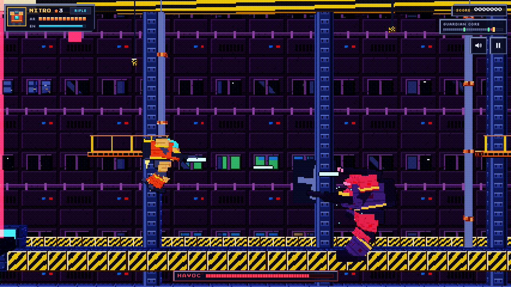
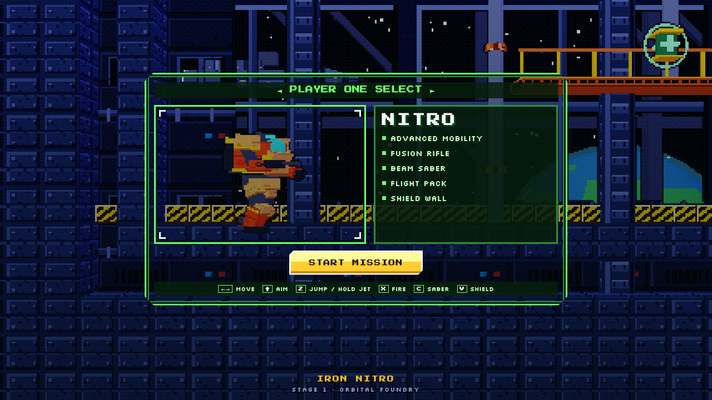
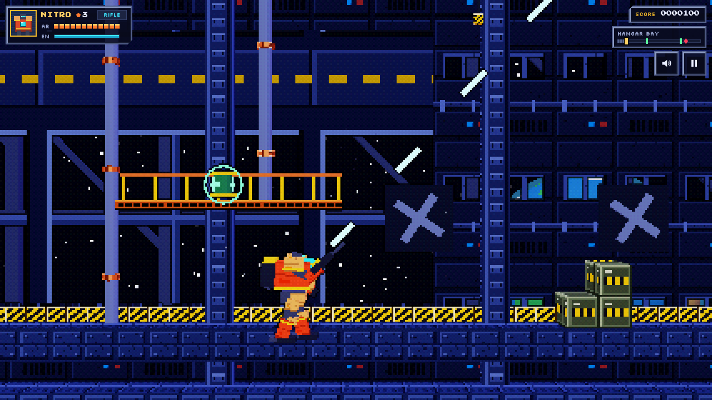
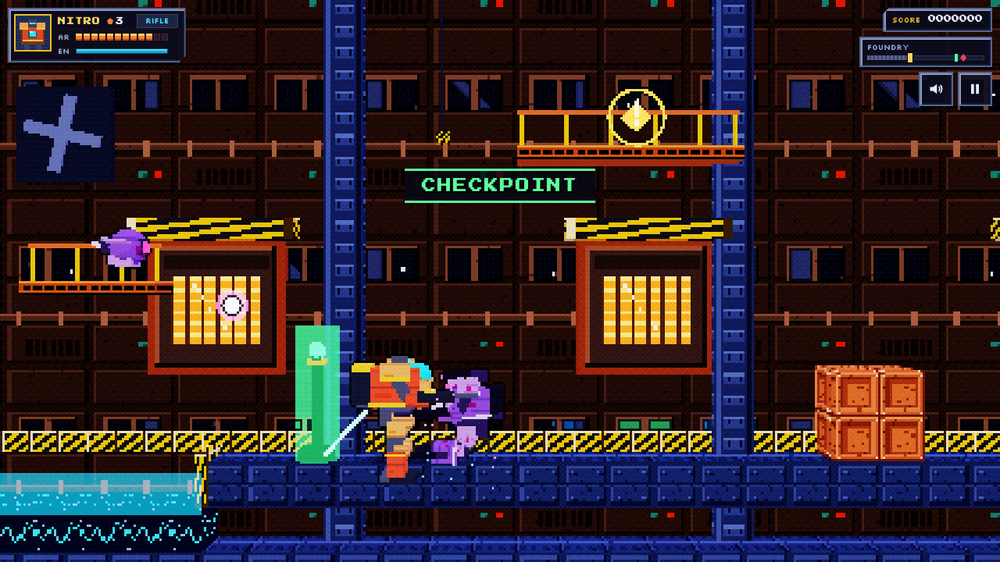
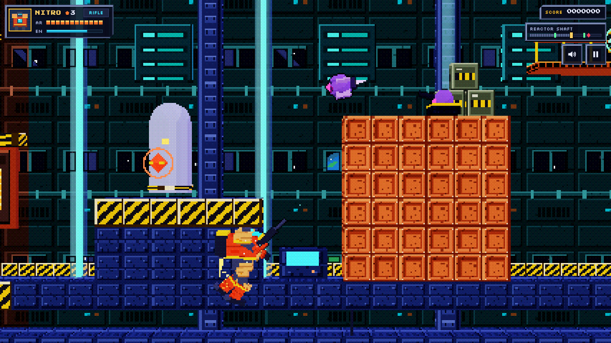
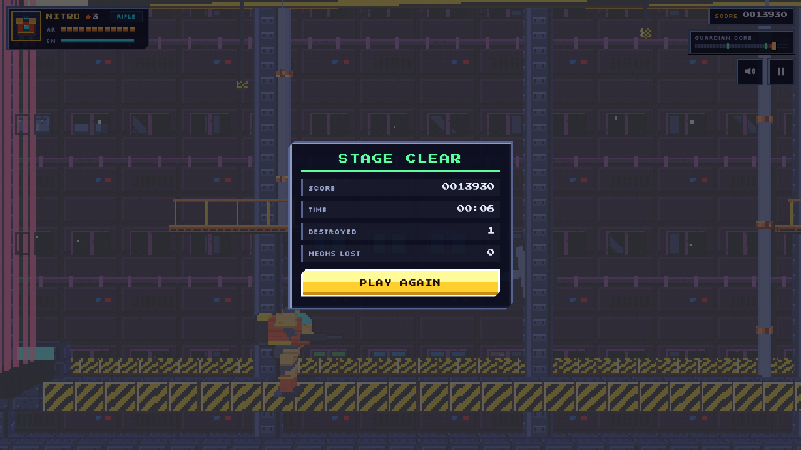
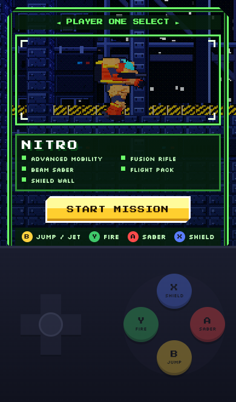
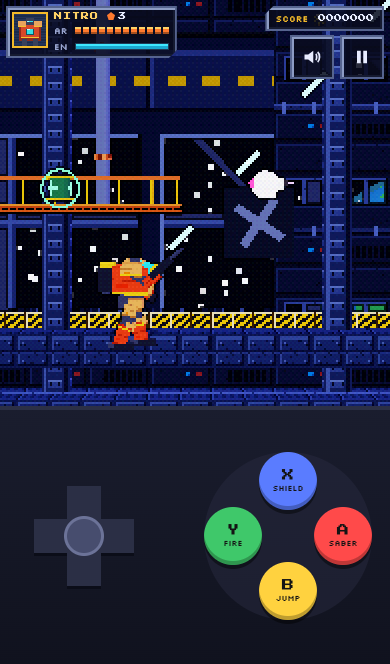
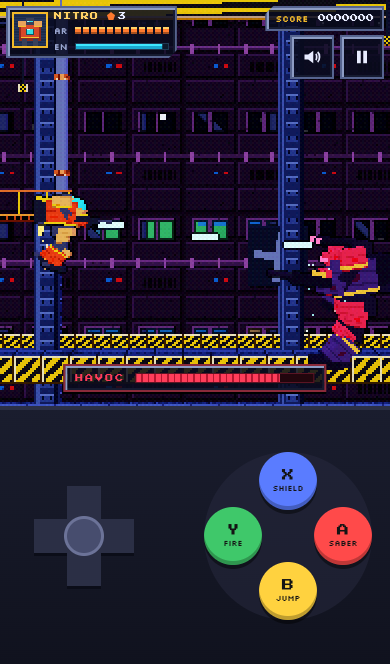

<div align="center">

# IRON NITRO — Orbital Foundry

**Ação mecha em rolagem lateral, com a alma dos 16 bits.**
Uma homenagem a *Metal Warriors* (SNES) feita em Three.js e jogável direto no navegador.

### [▶ JOGAR AGORA](https://douglastaquary.github.io/metal-warriors-demo/)

[](https://github.com/douglastaquary/metal-warriors-demo/actions/workflows/deploy-pages.yml)




</div>

## A missão

A estação orbital **Foundry** caiu nas mãos do guardião **HAVOC**. Você pilota o **NITRO**, um mech de assalto com rifle de fusão, sabre de energia, jetpack e escudo. Atravesse o hangar, a fundição e o poço do reator, abrindo caminho entre drones, soldados-mech e torretas, até o núcleo onde o guardião espera.

## Destaques

- **Visual 2.5D pixelado de verdade.** Os modelos low-poly são renderizados em ~240 linhas, com paleta de 15 bits, dithering Bayer e contorno por profundidade, e depois ampliados em escala inteira, como num console de 16 bits.
- **Um mech que responde bem.** Pulo com *coyote time*, jetpack que entra ao segurar o pulo no ar, mira em 45°, tiro triplo como power-up e um sabre que **rebate tiros inimigos** de volta com o dobro de dano.
- **Energia compartilhada.** O jetpack e o escudo usam a mesma barra, então cada segundo no ar é um segundo a menos de defesa.
- **Inimigos com leitura clara.** Drones avisam antes de atirar, soldados-mech miram com laser e levantam a guarda, torretas giram atrás de você. Todo ataque tem aviso visual.
- **Chefe em 3 fases.** HAVOC dispara rajadas de canhão, pisa no chão e manda ondas de choque que você precisa pular, investe contra as paredes e chama reforços quando está ferido.
- **Quatro áreas com identidade própria:** hangar azul com janelas para o planeta, fundição de ferrugem com fornalhas acesas, reator verde-azulado com tubos de refrigeração e arena magenta sob alarme.
- **Pronto para o celular.** No modo retrato a tela fica em cima e o controle embaixo, como num portátil, com direcional e botões A/B/X/Y no layout do SNES.
- **Áudio 100% procedural.** Efeitos sonoros e três trilhas (título, fase e chefe) são sintetizados em tempo real com Web Audio, sem nenhum arquivo de áudio.

## Galeria

<table>
  <tr>
    <td width="50%"><br><sub><b>Player One Select:</b> o NITRO na janela de seleção</sub></td>
    <td width="50%"><br><sub><b>Hangar Bay:</b> janelas panorâmicas para a frota</sub></td>
  </tr>
  <tr>
    <td><br><sub><b>Foundry:</b> escudo erguido e sabre contra um soldado-mech</sub></td>
    <td><br><sub><b>Reactor Shaft:</b> subindo de jetpack sob fogo de drones</sub></td>
  </tr>
  <tr>
    <td><br><sub><b>Guardian Core:</b> duelo contra o HAVOC</sub></td>
    <td><br><sub><b>Stage Clear:</b> pontuação, tempo e abates</sub></td>
  </tr>
</table>

### No celular

<table>
  <tr>
    <td width="33%"></td>
    <td width="33%"></td>
    <td width="33%"></td>
  </tr>
</table>

## Controles

| Ação | Teclado | Gamepad | Toque |
| --- | --- | --- | --- |
| Mover / mirar | Setas ou WASD | Analógico / D-pad | Direcional |
| Pular / jetpack (segure no ar) | Z, K, Espaço | A | B (amarelo) |
| Atirar | X, J | X ou RT | Y (verde) |
| Sabre (rebate tiros) | C, L | B ou Y | A (vermelho) |
| Escudo | V, I, Shift | LB, RB ou LT | X (azul) |
| Pausa | Esc, P | Select / Start | Botão ❚❚ |

Baixo + pular desce das passarelas.

## Por dentro

- **Three.js + TypeScript (strict) + Vite.** Nenhum asset externo: texturas, modelos, efeitos e áudio são gerados por código.
- **Pipeline de pixel:** render HDR em baixa resolução, depois um shader de composição (tone mapping ACES, quantização, dithering, contornos) e ampliação por *nearest neighbor*.
- **Simulação em passo fixo de 120 Hz,** com colisão AABB em grade de tiles, passarelas atravessáveis, *hitstop* e *screenshake*.
- **Leve:** cerca de 167 KB de JavaScript com gzip e de 90 a 160 draw calls por quadro.
- **Testado:** bot de playtest com entrada real, testes visuais em desktop e celular (Playwright) e inspeção automática de canvas em 11 estados de jogo.

## Rodar localmente

```bash
npm install
npm run dev        # http://127.0.0.1:5188
npm run build      # typecheck + bundle em dist/
npm run preview    # http://127.0.0.1:4188
```

Requer Node 20.19+ ou 22.x. Cada push no `main` publica o jogo no GitHub Pages pelo workflow `.github/workflows/deploy-pages.yml`.

### Debug e testes

- `http://127.0.0.1:5188/?debug` abre o painel lil-gui (somente em dev).
- `window.__THREE_GAME_TEST_HOOKS__` e `window.__THREE_GAME_DIAGNOSTICS__` expõem estados de teste e métricas.
- `npm test` roda `tests/visual.spec.ts` e `tests/bot-playtest.spec.ts` (precisa do Chromium: `npx playwright install --no-shell chromium`).
- `npm run inspect:canvas -- --manifest artifacts/evidence.json --url http://127.0.0.1:5188 --seed 42` gera capturas e relatórios em `artifacts/<runId>/`.

---

<div align="center"><sub>Projeto de fã, sem fins comerciais. <i>Metal Warriors</i> é marca de seus respectivos donos.</sub></div>
